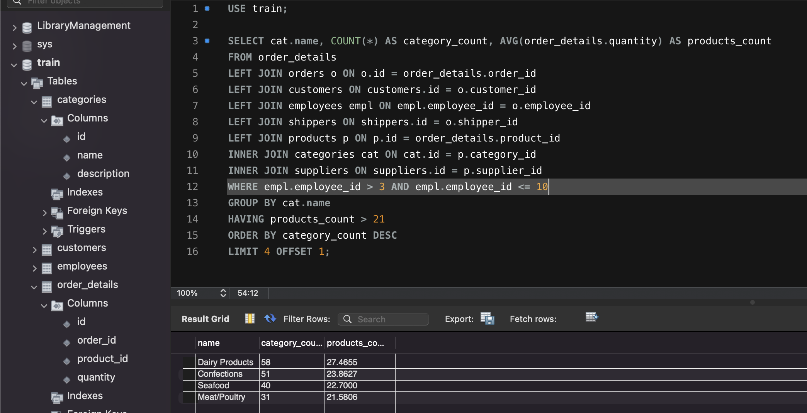

# Домашнє завдання до Теми 4. DML та DDL команди. Складні SQL вирази

## 1. Створіть базу даних для керування бібліотекою книг згідно зі структурою, наведеною нижче. Використовуйте DDL-команди для створення необхідних таблиць та їх зв'язків.


#### a) Назва схеми — “LibraryManagement”
```js
CREATE SCHEMA LibraryManagement;
```
#### b) Таблиця "authors":
- author_id (INT, автоматично зростаючий PRIMARY KEY)
- author_name (VARCHAR)

```js
CREATE TABLE authors(author_id INT PRIMARY KEY AUTO_INCREMENT, author_name VARCHAR(255))
```
#### c) Таблиця "genres":
- genre_id (INT, автоматично зростаючий PRIMARY KEY)
- genre_name (VARCHAR)
```js
CREATE TABLE genres(genre_id INT PRIMARY KEY AUTO_INCREMENT, genre_name VARCHAR(255));
```
#### d) Таблиця "books":
- book_id (INT, автоматично зростаючий PRIMARY KEY)
- title (VARCHAR)
- publication_year (YEAR)
- author_id (INT, FOREIGN KEY зв'язок з "Authors")
- genre_id (INT, FOREIGN KEY зв'язок з "Genres")
```js
CREATE TABLE books(book_id INT PRIMARY KEY AUTO_INCREMENT, title VARCHAR(255),
publication_year YEAR, author_id INT, FOREIGN KEY (author_id) REFERENCES authors(author_id),
genre_id INT, FOREIGN KEY (genre_id) REFERENCES genres(genre_id));
```
#### e) Таблиця "users":
- user_id (INT, автоматично зростаючий PRIMARY KEY)
- username (VARCHAR)
- email (VARCHAR)
```js
CREATE TABLE users(user_id INT PRIMARY KEY AUTO_INCREMENT, username VARCHAR(255),
email VARCHAR(255));
```
#### f) Таблиця "borrowed_books":
- borrow_id (INT, автоматично зростаючий PRIMARY KEY)
- book_id (INT, FOREIGN KEY зв'язок з "Books")
- user_id (INT, FOREIGN KEY зв'язок з "Users")
- borrow_date (DATE)
- return_date (DATE)
```js
CREATE TABLE borrowed_books(borrow_id INT PRIMARY KEY AUTO_INCREMENT,
book_id INT, FOREIGN KEY (book_id) REFERENCES books(book_id),
user_id INT, FOREIGN KEY (user_id) REFERENCES users(user_id),
borrow_date DATE, return_date DATE);
```
## 2. Заповніть таблиці простими видуманими тестовими даними. Достатньо одного-двох рядків у кожну таблицю.

```js

INSERT INTO authors(author_name)
VALUES('Ethan Johnson'), ('Olivia White'), ('Jackson Miller'), ('Ava Thompson');

INSERT INTO genres(genre_name)
VALUES('Science Fiction'), ('Mystery'), ('Romance'), ('Adventure'),
('Horror'), ('Non-fiction'), ('Fantasy'), ('Historical Fiction'),
('Poetry'), ('Comedy');

INSERT INTO books(title, publication_year, author_id, genre_id)
VALUES("The Martian", 2011, 1, 1), ("Gone Girl", 2012, 2, 2),
("Pride and Prejudice", 2003, 3, 3), ("The Hobbit", 2002, 4, 7);

INSERT INTO users(username, email)
VALUES("john_doe", "john.doe@example.com"),
("jane_smith", "jane.smith@example.com"),
("alexander_wang", "alexander.wang@example.com"),
("sophia_garcia", "sophia.garcia@example.com"),
("michael_adams", "michael.adams@example.com");

INSERT INTO borrowed_books(book_id, user_id, borrow_date, return_date)
VALUES(1, 1, "2023-05-10", "2023-06-10"),
(2, 2, "2022-09-15", "2022-10-15"),
(3, 3, "2022-09-20", "2022-10-19"),
(4, 4, "2022-09-20", "2022-10-22");


```

## 3. Перейдіть до бази даних, з якою працювали у темі 3. Напишіть запит за допомогою операторів FROM та INNER JOIN, що об’єднує всі таблиці даних, які ми завантажили з файлів: order_details, orders, customers, products, categories, employees, shippers, suppliers. Для цього ви маєте знайти спільні ключі. Перевірте правильність виконання запиту.
```js

SELECT * 
FROM order_details
INNER JOIN orders o ON o.id = order_details.order_id
INNER JOIN customers ON customers.id = o.customer_id
INNER JOIN employees empl ON empl.employee_id = o.employee_id
INNER JOIN shippers ON shippers.id = o.shipper_id
INNER JOIN products p ON p.id = order_details.product_id
INNER JOIN categories cat ON cat.id = p.category_id
INNER JOIN suppliers ON suppliers.id = p.supplier_id;

```


## 4. Виконайте запити, перелічені нижче.

- Визначте, скільки рядків ви отримали (за допомогою оператора COUNT).
```js
SELECT COUNT(*)
FROM order_details
INNER JOIN orders o ON o.id = order_details.order_id
INNER JOIN customers ON customers.id = o.customer_id
INNER JOIN employees empl ON empl.employee_id = o.employee_id
INNER JOIN shippers ON shippers.id = o.shipper_id
INNER JOIN products p ON p.id = order_details.product_id
INNER JOIN categories cat ON cat.id = p.category_id
INNER JOIN suppliers ON suppliers.id = p.supplier_id;
```


- Змініть декілька операторів INNER на LEFT чи RIGHT.
```js
SELECT COUNT(*)
FROM order_details
LEFT JOIN orders o ON o.id = order_details.order_id
LEFT JOIN customers ON customers.id = o.customer_id
LEFT JOIN employees empl ON empl.employee_id = o.employee_id
LEFT JOIN shippers ON shippers.id = o.shipper_id
LEFT JOIN products p ON p.id = order_details.product_id
INNER JOIN categories cat ON cat.id = p.category_id
INNER JOIN suppliers ON suppliers.id = p.supplier_id;
```

> Визначте, що відбувається з кількістю рядків. Чому? 
```text
Операція LEFT JOIN об'єднує рядки із двох таблиць за певною умовою та включення всіх рядків з лівої таблиці, навіть якщо вони не мають відповідності в правій таблиці. Якщо немає відповідності в правій таблиці, виводяться значення NULL.

RIGHT JOIN аналогічний LEFT JOIN: результатом буде таблиця, яка містить усі стовпці з правої таблиці, у нашому випадку це таблиця age. Якщо немає відповідності в names, то виводяться значення NULL.

В нащому випадку кількість рядків не змінилась, що означає що дані не повторюються (інакше б кількість рядків зменшилась).
Також всі рядки мають відповідність з правої таблиці (інакше б кількість рядків збільшилась)
```
- Оберіть тільки ті рядки, де employee_id > 3 та ≤ 10.
```js
SELECT COUNT(*)
FROM order_details
LEFT JOIN orders o ON o.id = order_details.order_id
LEFT JOIN customers ON customers.id = o.customer_id
LEFT JOIN employees empl ON empl.employee_id = o.employee_id
LEFT JOIN shippers ON shippers.id = o.shipper_id
LEFT JOIN products p ON p.id = order_details.product_id
INNER JOIN categories cat ON cat.id = p.category_id
INNER JOIN suppliers ON suppliers.id = p.supplier_id
WHERE empl.employee_id > 3 AND empl.employee_id <= 10
```


- Згрупуйте за іменем категорії, порахуйте кількість рядків у групі, середню кількість товару (кількість товару знаходиться в order_details.quantity)
```js
SELECT cat.name, COUNT(*) AS category_count, AVG(order_details.quantity) AS products_count
FROM order_details
LEFT JOIN orders o ON o.id = order_details.order_id
LEFT JOIN customers ON customers.id = o.customer_id
LEFT JOIN employees empl ON empl.employee_id = o.employee_id
LEFT JOIN shippers ON shippers.id = o.shipper_id
LEFT JOIN products p ON p.id = order_details.product_id
INNER JOIN categories cat ON cat.id = p.category_id
INNER JOIN suppliers ON suppliers.id = p.supplier_id
WHERE empl.employee_id > 3 AND empl.employee_id <= 10
GROUP BY cat.name;
```


- Відфільтруйте рядки, де середня кількість товару більша за 21.
```js
SELECT cat.name, COUNT(*) AS category_count, AVG(order_details.quantity) AS products_count
FROM order_details
LEFT JOIN orders o ON o.id = order_details.order_id
LEFT JOIN customers ON customers.id = o.customer_id
LEFT JOIN employees empl ON empl.employee_id = o.employee_id
LEFT JOIN shippers ON shippers.id = o.shipper_id
LEFT JOIN products p ON p.id = order_details.product_id
INNER JOIN categories cat ON cat.id = p.category_id
INNER JOIN suppliers ON suppliers.id = p.supplier_id
WHERE empl.employee_id > 3 AND empl.employee_id <= 10
GROUP BY cat.name
HAVING products_count > 21;
```


- Відсортуйте рядки за спаданням кількості рядків.
```js
SELECT cat.name, COUNT(*) AS category_count, AVG(order_details.quantity) AS products_count
FROM order_details
LEFT JOIN orders o ON o.id = order_details.order_id
LEFT JOIN customers ON customers.id = o.customer_id
LEFT JOIN employees empl ON empl.employee_id = o.employee_id
LEFT JOIN shippers ON shippers.id = o.shipper_id
LEFT JOIN products p ON p.id = order_details.product_id
INNER JOIN categories cat ON cat.id = p.category_id
INNER JOIN suppliers ON suppliers.id = p.supplier_id
WHERE empl.employee_id > 3 AND empl.employee_id <= 10
GROUP BY cat.name
HAVING products_count > 21
ORDER BY category_count DESC;
```


- Виведіть на екран (оберіть) чотири рядки з пропущеним першим рядком.
```js
USE train;

SELECT cat.name, COUNT(*) AS category_count, AVG(order_details.quantity) AS products_count
FROM order_details
LEFT JOIN orders o ON o.id = order_details.order_id
LEFT JOIN customers ON customers.id = o.customer_id
LEFT JOIN employees empl ON empl.employee_id = o.employee_id
LEFT JOIN shippers ON shippers.id = o.shipper_id
LEFT JOIN products p ON p.id = order_details.product_id
INNER JOIN categories cat ON cat.id = p.category_id
INNER JOIN suppliers ON suppliers.id = p.supplier_id
WHERE empl.employee_id > 3 AND empl.employee_id <= 10
GROUP BY cat.name
HAVING products_count > 21
ORDER BY category_count DESC
LIMIT 4 OFFSET 1;
```
